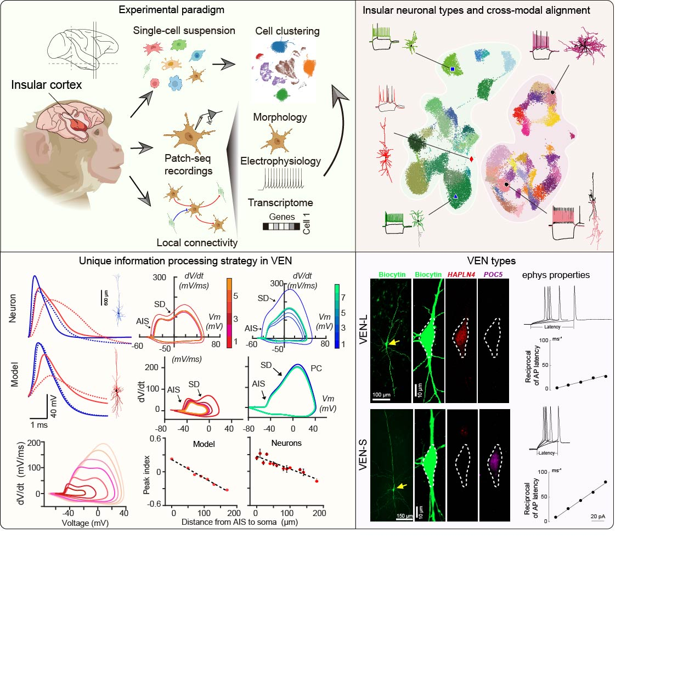

# Cell Atlas and Novel Signal Processing Strategy in Primate Insular Cortex

Rui-Feng Liu*, Mengyao Huang*, Yuhui Shen*, Mingting Shao*, Junzhan Jing, Nana Xu, Lei Tang, Biaodi Liu, Jianming Shi,  Fanrui Chen, Zhao-Zhe Hao, Xiaolong Jiang and Sheng Liu

### This repository contains the analysis code and the preprocessed data for the above manuscript.

-----------------------------------------------
### Repository Structure

The repository is organized as follows:

&emsp;&emsp;● 10X: Contains Jupyter notebooks for the analysis of scRNA-seq data (10X Genomics) and the generation of related figures.

&emsp;&emsp;● Metabolism: Contains the normalized metabolic data table and code used to generate related figures (Figure 8 and Extended Data Figure 10).

&emsp;&emsp;● Modeling: Contains hoc scripts for neuron models (Neuron 8.0) and MATLAB code for generating related figures.

&emsp;&emsp;● Ephys: Contains Python and MATLAB code for electrophysiological data analysis and figure generation.

&emsp;&emsp;● Morphology: Contains Python and MATLAB code for morphological data analysis and figure generation.

&emsp;&emsp;● Patch-seq: Contains code for analyzing the transcriptomic data of Patch-seq cells.

&emsp;&emsp;● Patch-seq Mapping to 10X: Contains code for mapping Patch-seq neurons transcriptomically to the scRNA-seq neuronal atlas.

--------------------------------------
### Preprocessed data and meta data

Due to their large size, all processed data files have been deposited at ZENODO and are organized in the same hierarchical folder structure as presented here (Github). They are available for download from https://doi.org/10.5281/zenodo.17799560.

------------------------------------------------
### Reproduce the analysis figures

After downloading the processed data from Zenodo, place it into the corresponding directories within the GitHub repository's data folders. Then, execute the provided Python notebooks or MATLAB scripts to regenerate the figures.

We constructed the computational models using NEURON (version 8.0). The corresponding hoc scripts are available in the <code>'modelling/'</code> folder, with specific experimental models organized in relevant sub-folders. MATLAB scripts for plotting the figures are located in <code> 'modeling/FigPlot/' </code>. Simulated neuronal traces data are also deposited in ZENODO.

-------------------------------------------------
### Raw data

All primary datasets from this study have been deposited in public repositories.

&emsp;&emsp;● Transcriptomics: Raw transcriptomic data in FASTQ format—including both scRNA-seq (10x) and Patch-seq data—are available at NCBI GEO under accession codes GSExxxx1 and GSExxxx2, respectively.

&emsp;&emsp;● Electrophysiology: Raw electrophysiological data in NWB format, along with corresponding metadata, can be accessed from the DANDI Archive at http://dandiarchive.org/dandiset/xxxxxxxx. This dataset includes recordings of firing patterns, multi-patch configurations, postsynaptic current traces, and outside-out sodium currents.

&emsp;&emsp;● Morphology: Raw morphological reconstructions are deposited at NeuroMorpho.Org and are available via the persistent link: https://doi.org/10.13021/y4be-0p18.

&emsp;&emsp;● Metabolomics: Raw metabolic data are available at MetaboLights under accession code https://www.ebi.ac.uk/metabolights/xxxxxxxx.

------------------------------------------
### Level of Support

We will update this code as necessary.

